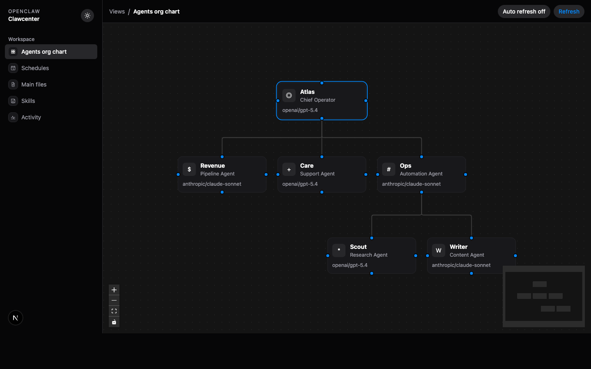
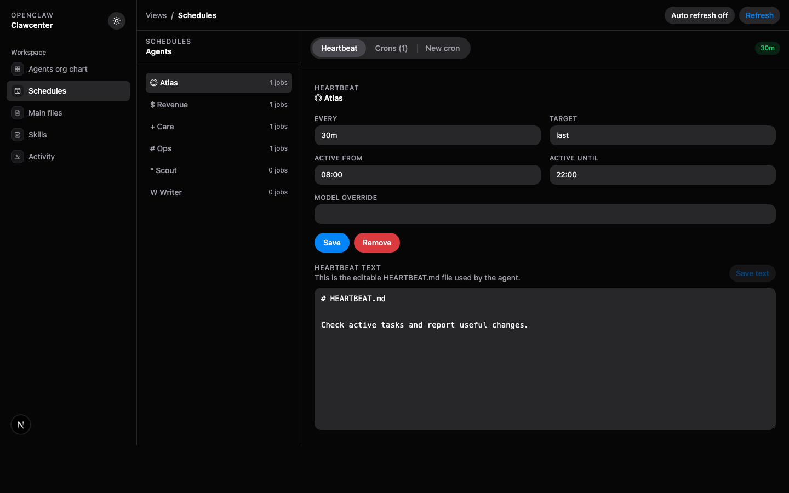
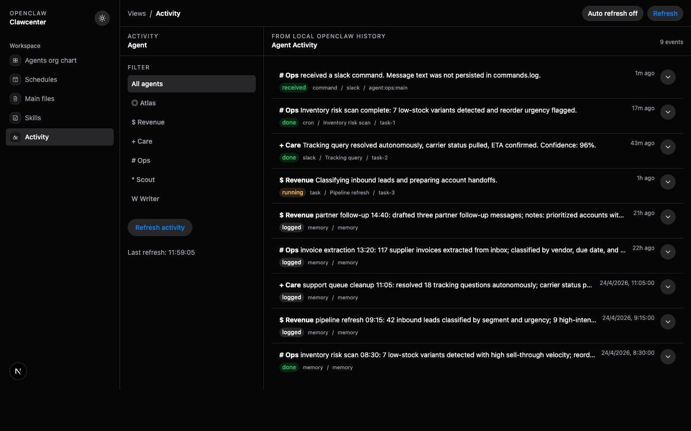

# Clawcenter

Control base for OpenClaw.

An Onwork project.

Clawcenter is an open-source local control plane for OpenClaw agents. It gives you one place to see the agent org chart, edit workspace knowledge, manage schedules, inspect installed skills, and read production activity from real OpenClaw logs.

OpenClaw runs the agents. Clawcenter shows what they are, what they know, when they run, and what they actually did.

## Why We Built This

OpenClaw agents can work across Slack, scheduled jobs, skills, memory files, and local artifacts. That power makes them useful, but it can also make operations hard to understand from one place. When agents are doing real work, a terminal and scattered markdown files are not enough.

Clawcenter started from a practical problem: the native OpenClaw Mission Control is useful, but editing installed skills and their markdown files is not simple enough, organizing many agents becomes difficult, and existing mission-control interfaces can feel overloaded with features that are not needed for daily operations.

Clawcenter is intentionally smaller. It focuses on the operations that matter most when running a lot of agents:

- Organize agents visually without digging through config files.
- Read agent activity as simple production logs instead of raw command metadata.
- Edit installed skill markdown files from a dedicated UI.
- Edit core agent files like `SOUL.md`, `TOOLS.md`, `MEMORY.md`, and `HEARTBEAT.md`.
- Control cron jobs and heartbeat settings without switching back to the CLI.
- Keep the interface minimal, fast, and focused on agent operations.

The goal is not to replace OpenClaw. OpenClaw runs the agents. Clawcenter gives humans a clean, local-first mission-control layer for operating them.

## Screenshots

The screenshots below use anonymized sample workspace data.







## Features

- Agent org chart with draggable positions and saved reporting lines.
- Agent identity editor for names, roles, descriptions, and operating style.
- Heartbeat and cron schedule management.
- Workspace file editor with backup-on-save:
  - `IDENTITY.md`
  - `SOUL.md`
  - `USER.md`
  - `MEMORY.md`
  - `TOOLS.md`
  - `AGENTS.md`
  - `HEARTBEAT.md`
  - `BOOTSTRAP.md`
- Workspace skills browser and markdown editor.
- Production activity feed powered by local OpenClaw task history, session history, command metadata, and workspace memory files.
- Light and dark mode using HeroUI defaults.
- Responsive layout for desktop and mobile.

## Getting Started

Clawcenter is a local UI for an existing OpenClaw installation. It expects OpenClaw state to already exist on your machine.

1. Clone the repository:

```bash
git clone https://github.com/borjasolerme/Clawcenter.git
cd Clawcenter
```

2. Install dependencies:

```bash
npm install
```

3. Make sure OpenClaw is available:

```bash
openclaw --help
```

4. Start Clawcenter:

```bash
npm run dev
```

5. Open the app:

```text
http://localhost:3030
```

If your OpenClaw config is not in the default location, point Clawcenter to it before starting:

```bash
OPENCLAW_CONFIG_PATH=/path/to/openclaw.json npm run dev
```

## Requirements

- Node.js 22+
- OpenClaw installed and available as `openclaw`
- A local `~/.openclaw` workspace

## Notes

- This app reads and writes your local `~/.openclaw` state from Next.js server routes.
- Config and file writes create timestamped backups first.
- Cron listing/mutations require the OpenClaw gateway scheduler to be reachable.
- Activity entries are local-only. Clawcenter does not ship your agent logs anywhere.
- Dependency installation requires DNS/network access to `registry.npmjs.org`.

## Security

Clawcenter is designed as a local operator tool. It can read and edit local OpenClaw agent files, installed skill markdown files, heartbeat settings, org-chart data, and cron jobs.

Do not expose a running Clawcenter server to the public internet without adding authentication and network controls. For normal use, run it on localhost or a trusted private network.

## License

MIT
